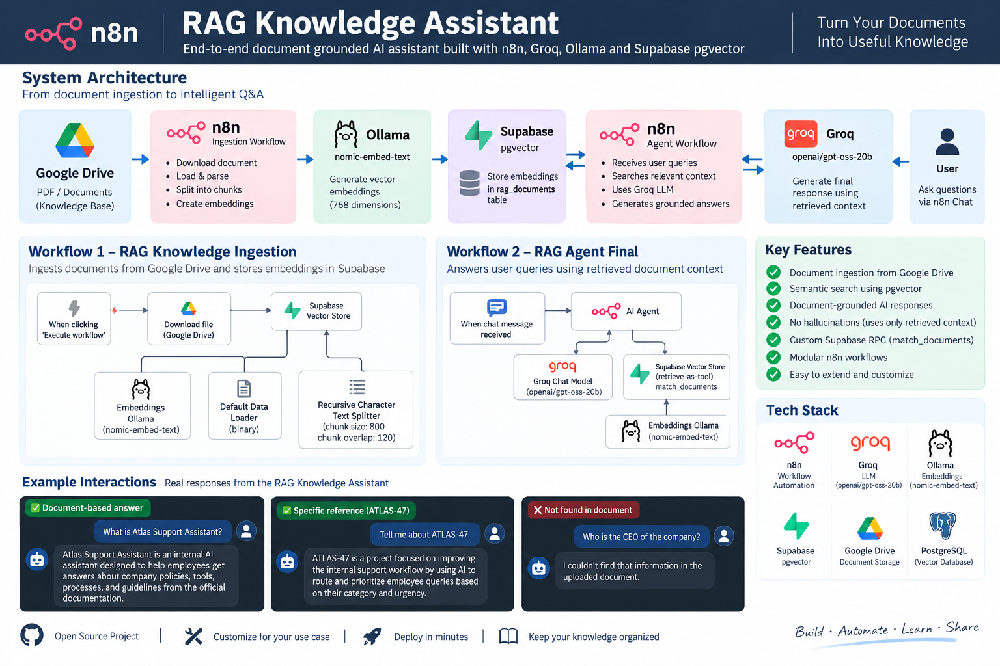

# n8n RAG Knowledge Assistant

End-to-end Retrieval-Augmented Generation (RAG) assistant built with n8n, Groq, Ollama, Supabase pgvector, and Google Drive.

## System Architecture



The system separates document ingestion from question answering. Documents are processed and embedded into Supabase pgvector, while the AI Agent retrieves relevant context before generating grounded responses.

## Workflows

### Workflow 1 — RAG Knowledge Ingestion

The ingestion workflow prepares documents for semantic search.

**Pipeline:**

Google Drive → PDF Download → Data Loader → Text Splitting → Ollama Embeddings → Supabase pgvector

**Configuration:**
- Chunk size: 800 characters
- Chunk overlap: 120 characters
- Embedding model: `nomic-embed-text`
- Embedding dimensions: 768
- Vector table: `rag_documents`

### Workflow 2 — RAG Agent Final

The agent workflow handles user questions and retrieves relevant document context before generating an answer.

**Pipeline:**

Chat Trigger → AI Agent → Supabase Vector Store → Retrieved Context → Groq LLM → Answer

**LLM:** `openai/gpt-oss-20b`

**Vector retrieval:** `match_documents`

## Key Features

- 📄 PDF knowledge-base ingestion
- 🔎 Semantic vector search using Supabase pgvector
- 🧠 Ollama `nomic-embed-text` embeddings
- 🤖 AI Agent with tool-based retrieval
- ⚡ Groq `openai/gpt-oss-20b` for response generation
- 🔐 Document-grounded responses
- 🛑 Prevents unsupported answers when information is not found
- 🔄 Separate ingestion and query workflows
- 🧩 Modular n8n architecture

## Technology Stack

| Technology | Purpose |
|---|---|
| n8n | Workflow automation and AI Agent orchestration |
| Google Drive | Knowledge-base document storage |
| Ollama | Local embedding generation |
| nomic-embed-text | 768-dimensional embeddings |
| Supabase | PostgreSQL + pgvector vector storage |
| Groq | LLM inference |
| GPT-OSS-20B | Response generation |
| PostgreSQL | Vector database backend |

## Configuration

- Chunk size: 800
- Chunk overlap: 120
- Embedding dimensions: 768
- Vector table: `rag_documents`
- Retrieval RPC: `match_documents`
- Retrieval limit: 4

## Verified tests

- Project name → `Atlas Support Assistant`
- Project code → `ATLAS-47`
- Embedding model → `nomic-embed-text`
- Unknown CEO question → information not found in the uploaded document

## Structure

```text
n8n-rag-knowledge-assistant/
├── workflows/
│   ├── rag-knowledge-ingestion.json
│   └── rag-agent-final.json
├── database/
│   └── match_documents.sql
├── README.md
└── .gitignore
```

## Security

Workflow exports are sanitized to remove n8n credential references and instance-specific identifiers. Never commit API keys, passwords, `.env` files, or credential exports.
